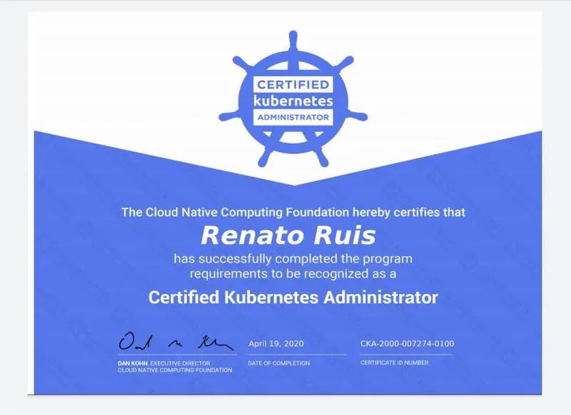

+++
author = 'Tim DevOps'
title = 'CKA Consegui Com Dicas Importantes'
date = 2020-05-03
+++

## CKA Consegui com dicas importantes

## Hey \o

Quero compartilhar um pouco de como consegui essa certificação que é muito requisitada/cobiçada

Vou ser simples e objetivo direto ao ponto, pois sei que se você está lendo isso, provavelmente, já leu muita coisa sobre CKA na internet.

## Curiosidades sobre o exame

**Informaçòes oficiais: **Você provavelmente já leu no site oficial sobre o exame em si, se não, você precisa ler tudo sobre [aqui](https://www.cncf.io/certification/cka/) de verdade leia e releia, leia as letrinha pequenas e e esse [pdf](https://training.linuxfoundation.org/wp-content/uploads/2020/04/CKA-CKAD-FAQ-April2020.pdf) aqui também, mas vou deixar pontos que acho importante e que aconteceu comigo.

**Idioma **Uma coisa que ficou um pouco confuso pra mim, no site da CNCF nesse [link](https://www.cncf.io/certification/cka/faq/) diz que o exame é oferecido em “portuguese” mas nesse [pdf](https://training.linuxfoundation.org/wp-content/uploads/2020/04/CKA-CKAD-FAQ-April2020.pdf) não exibe “portuguese” como um idioma disponivel, qual agendei o exame realmente não tem a opçao de idioma pt-BR, agendei assim mesmo, o inglês não foi um problema pois a liguagem usada nas questões é bem direta e objetiva.

> Dica: Usei essa [extensão](https://chrome.google.com/webstore/detail/google-translate/aapbdbdomjkkjkaonfhkkikfgjllcleb?utm_source=chrome-ntp-icon) do chrome, você pode configurar ela para quando você selecionar uma palavra ou frase ela exibe um pop-up com a tradução.

**Exames duplicados na plataforma? **quando eu efetivamente comprei o exame (aproveitei a “Black Friday”) e paguei a metade do valor. Então apareceu dois exames disponíveis, eu pensei. — Nossa que sorte! tenho quatro tentativas já que tem retake cada uma delas. **#SQN** um é o exame e o outro é o retake :(

**Simulados: **foi a melhor ferramenta de estudo que tive, alé de outros pontos que vou mencionar mais para frente, não ignore eles, simule de verdade como se fosse o dia do exame, inclusive simule todos os procedimentos de seguir extritamente o que o manual do candidato diz como por exemplo: desligar o celular, colocar um timer (importantíssimo), usar apenas duas abas do navegador uma para o simulado e outra para a página da [documentação oficial afinal do Kubernetes](https://kubernetes.io/docs/home/) pois você poderá usar ela e **somente ela **no momento do exame **AH! não pode pesquisar o google o termo, mesmo que for pra “cair” na documentação depois** use o campo de busca dentro da página da documentação mesmo.

**Experiência com Kubernetes **Você não precisa ter experiência na “vida real” e/ou “ambientes de produção” para realizar o exame, porém se tiver, melhor ainda :)

**KUBECTL **Se não conhece ainda vai conhecer, você precisa estar muito bem familiarizado com ele para ganhar tempo durante o exame, pois pelo menos no meu caso, acredito que 60% das questões você soluciona usando ele, claro que tem questões mais “azeda” que só ele não vai ajudar.

> Dica: Treine muito –generator, –dry-run, -o yaml e -o=jsonpath= Dica2: No ambiente do exame o autocomplete do kubectl já vem habilitado Sim, para mim caiu algumas questões que requeria o jsonpath dá uma olhada [aqui](https://kubernetes.io/docs/reference/kubectl/jsonpath/) sobre como usar ele corretamente com kubectl

**PROCTORED **Sim o exame é monitorado o tempo todo e não é brincadeira, você tem que seguir exatamente tudo o que esta nos requisitos do exame, para você ter uma idéia o proctor pediu pra eu filmar além do quarto todo (dar uma volta com o note no quarto), pediu para filmar até embaixo da mesa, então, esteja preparado para esse momento um tanto constrangedor.

## Ferramentas de estudo

**KODEKLOUD **esse curso realmente é sensacional e cobre todos os requisitos do exame, eles tem [essa](https://kodekloud.com/) plataforma onde você pode pagar um valor mensal ou anual e ter acesso a todos os cursos que tem uma qualidade altíssima e boa metodologia, é em ingles (Indiano) tem sotaque mas isso não atrapalha e tem legenda.

> Dica: Caso não queira ou não possa pagar a plataforma, o mesmo curso, sim! o mesmo curso é oferecido na Udemy [aqui](https://www.udemy.com/course/certified-kubernetes-administrator-with-practice-tests/) Dica2: Os Simulados deste curso realmente está muito próximo do exame real (vai por mim) principalmente os simulados chamados de “Mock Exam” Dica3: Eles tem alguns cursos para DevOps gratuítos com a mesma qualidade :)

**HARD WAY **Como o próprio nome diz é bem díficil seguir esse caminho, porém te dá uma boa visão do Kubernetes como um “todo” já que nesse modo hard você tem que “subir” um cluster no modo raiz

**Linux Tips **é um curso que não é focado específicamente no exame, tanto que o nome do curso é [Descomplicando o Kubernetes](https://www.linuxtips.io/product-page/descomplicando-o-kubernetes) e te dá um overview e uma aprofundada bacana, inclusive com aulas extras de como subir um cluster multi master, o [Jeferson Noronha](https://www.linkedin.com/in/jefersonfernando/) tem um “Jeitão” todo descolado de ensinar e é sempre solícito, vale muito a pena.

Então é isso! Se ao menos uma dessas dicas te ajudou ou você achou interessante, compartilhe com seus amigos e colegas de trabalho, afinal somos comunidade. abraços!
