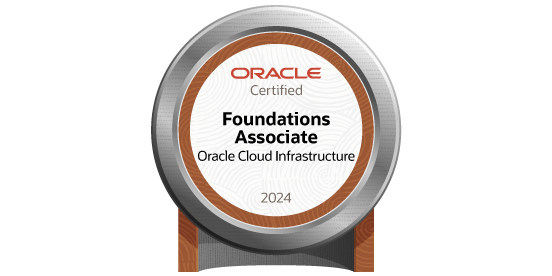

+++
author = 'Tim DevOps'
title = 'Como Conquistei a Certificacao OCI 2024 Foundations Associate Totalmente De Graça'
date = 2024-09-13T19:14:23-03:00

tags = [
  "Oracle Cloud",
  "Certificação Gratuita",
  "OCI 2024 Foundations Associate",
  "Oracle University",
  "Cloud Computing",
  "Dicas de Certificação",
  "Exame Não Supervisionado",
]

categories = [
  "Certificações",
  "Tecnologia",
  "Cloud",
  "Oracle",
]

+++

Hey \o

Quero compartilhar com vocês como conquistei a certificação **1Z0-1085-24 Oracle Cloud Infrastructure 2024 Foundations Associate**, e o melhor de tudo: **totalmente de graça!**

Vou ser simples e objetivo, direto ao ponto, pois sei que se você está lendo isso, provavelmente já pesquisou bastante sobre essa certificação.

---

**Curiosidades sobre o exame**

**Exame gratuito e não supervisionado:** Uma das grandes vantagens desse exame é que ele é **gratuito**! Isso mesmo, você não precisa desembolsar nada para realizar a prova. Além disso, o exame **não é supervisionado** (não é proctored) e pode ser feito ao final dos módulos diretamente na plataforma da Oracle University.

**Estudos na Oracle University:** Utilizei a plataforma da [Oracle University](https://education.oracle.com/) para me preparar. Os materiais são de alta qualidade e cobrem todos os tópicos que caem no exame. Ao final de cada módulo, você tem a opção de realizar o exame ali mesmo, o que facilita muito o processo.

**Idioma:** O exame está disponível em inglês, mas não se preocupe, a linguagem é bem direta e objetiva. Se tiver dificuldades, vale a pena usar ferramentas de tradução para auxiliar nos estudos.

---

**Dicas:**

- **Aproveite que é gratuito:** Não tem desculpa para não tentar. Como o exame é grátis, você pode fazê-lo sem medo de perder dinheiro.
- **Estude os módulos com atenção:** Mesmo sendo uma certificação de nível fundamental, é importante entender bem os conceitos apresentados nos módulos.
- **Experiência prática:** Se puder, crie uma conta trial na Oracle Cloud e explore os serviços. A experiência prática ajuda muito na compreensão dos conceitos.
- **Sem pressão:** Por não ser supervisionado, você pode fazer o exame no seu próprio ritmo, em um ambiente confortável.

---

**Outras certificações gratuitas**

Além dessa certificação, também estou fazendo o treinamento para a certificação **OCI AI Foundations Associate**, que segue o mesmo formato: gratuita e não supervisionada. Recomendo fortemente que você aproveite essa oportunidade para expandir seus conhecimentos em inteligência artificial na Oracle Cloud.

---

**O que vem por aí**

Recentemente, concluí o treinamento de **OCI OKE Specialist** e em breve vou escrever sobre essa experiência. Fiquem de olho!

---

Então é isso! Se ao menos uma dessas dicas te ajudou ou você achou interessante, compartilhe com seus amigos e colegas de trabalho. Afinal, somos comunidade. Abraços!
