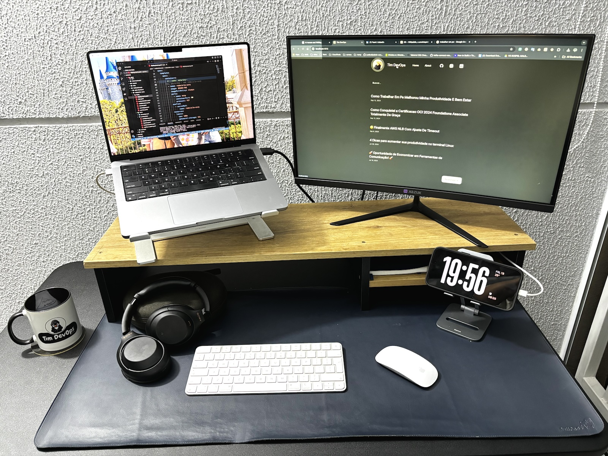
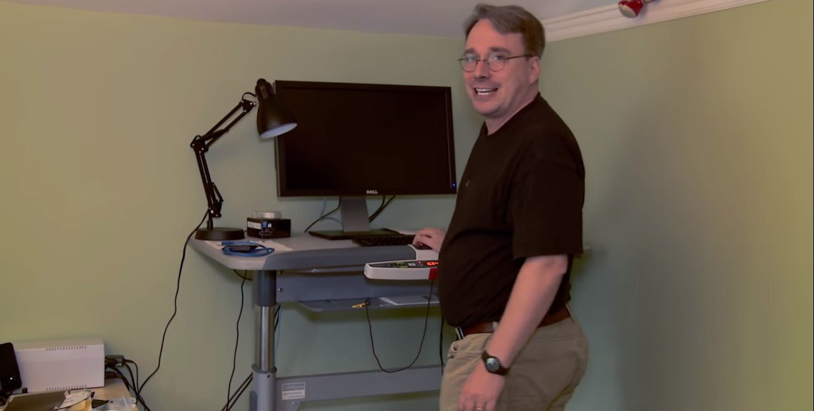

+++
author = 'Tim DevOps'
title = 'Como Trabalhar Em Pé Melhorou Minha Produtividade e Bem-Estar'
date = 2024-09-13T19:32:09-03:00

tags = ["Ergonomia", "Trabalho em Pé", "Mesas Ajustáveis", "Produtividade", "Saúde no Trabalho", "Husky", "Geniodesk", "Flexform", "Bem-Estar", "Home Office", "5S", "Minimalismo"]
categories = ["Saúde e Bem-Estar", "Produtividade", "Ergonomia"]
+++

  

# Hey \o/

Quero compartilhar com vocês como adotar o hábito de **trabalhar em pé** durante alguns momentos do dia tem melhorado minha disposição e produtividade. Tudo começou quando trabalhei com americanos e percebi que muitos deles já adotavam essa prática. Decidi tentar e não me arrependi!

## Por que Trabalhar em Pé?

Passamos grande parte do nosso tempo sentados, e isso pode causar vários problemas de saúde, como dores nas costas e má postura. Incorporar períodos de trabalho em pé ajudou a:

- Melhorar minha circulação
- Aumentar meus níveis de energia
- Estimular minha criatividade 💡

  <iframe src="https://giphy.com/embed/GU11pOufrKZJnNmD5X" width="270" height="480" style="" frameBorder="0" class="giphy-embed" allowFullScreen></iframe>
  
<a href="https://giphy.com/gifs/tim-devops-GU11pOufrKZJnNmD5X">via GIPHY</a>

## Equipamentos que Fazem a Diferença

Faz algum tempo que adquiri uma mesa com regulagem de altura da **Husky**, e apesar de não ser barata, foi um investimento que valeu cada centavo. Afinal, saúde não tem preço, né? 😂 Existem outras marcas no mercado brasileiro, como **Geniodesk** e **Flexform**, que também oferecem ótimas opções.

Para melhorar ainda mais minha ergonomia, uso suportes para elevar o segundo monitor e a tela do notebook até a altura dos olhos. Isso evita tensões no pescoço e melhora a postura. E, falando em cadeira, uma boa cadeira é essencial — cadeira gamer é uma péssima escolha, já tive algumas experiências ruins.

## Menos é Mais!

Simples e minimalista, já sou velho pra ter um monte de led, action figures e etc. Adotei os princípios do **5S** (não sabe o que é? [Olha aqui](https://pt.wikipedia.org/wiki/5S)) para manter meu espaço de trabalho minimalista e sem distrações. Um ambiente organizado facilita a concentração e a produtividade. **Menos é mais!** 🧘‍♂️ me inspirando em um cara que admiro muito 🐧

  

**Olha o ambiente de trabalho do Linus**

> I’m a huge believer in boring environments. Excitement is bad in kernels.
> **Tradução:** "Eu sou um grande defensor de ambientes entediantes. Empolgação é ruim em kernels.

## Dicas para Começar

1. **Comece aos Poucos:** Alternar entre trabalhar sentado e em pé a cada 30 minutos ajuda o corpo a se adaptar gradualmente. se não tiver uma mesa com regulagem de altura, coloque seu notebook em um lugar um pouco mais alto, uma bancada da cozinha ou faça alguma adaptação seja criativo, mas comece.
2. **Ajuste a Altura da Mesa:** Encontre uma posição confortável para você.
3. **Use um Tapete Anti-Fadiga:** Reduz o cansaço nas pernas. um pouco nutella mas é legal
4. **Faça Pausas Ativas:** Levantar-se para se alongar ou caminhar um pouco a cada hora aumenta ainda mais a produtividade.

## Compartilhe Suas Experiências!

Gostaria de saber como vocês estão adaptando seus espaços de trabalho! Deixem seus comentários e compartilhem suas experiências. Afinal, somos uma comunidade. Abraços!

---
