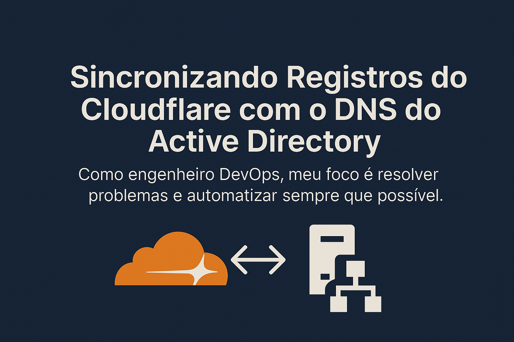
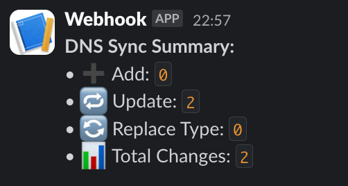

Trabalhar com ambientes híbridos — onde parte da infraestrutura roda local (on-premises) e outra parte já está na nuvem — traz alguns desafios que não estão nos manuais.
Um deles: **DNS inconsistente entre ambientes**.

---

## O cenário

Trabalhei num projeto que tinha bastante legado. Coisa fina: **Active Directory rodando DNS interno**, várias zonas internas, e aquele jeitão tradicional de TI raiz. Até aí tudo certo.

Mas no meio do caminho, as coisas mudaram...

A galera começou a criar novas aplicações na **nuvem (AWS)**, e — pra aproveitar o domínio bonito que a empresa já tinha — decidiram **usar o mesmo domínio externo (tipo `empresa.com.br`) pra essas novas aplicações**.

Resultado? Uma confusão de DNS 😅

---

## O problema real

Quando alguém dentro da empresa (ou conectado pela VPN) tentava acessar `api.novaplataforma.empresa.com.br`, **não funcionava**. Por quê?

Porque dentro da empresa, **quem resolvia o DNS era o servidor interno do AD**, e ele **não sabia nada** dos registros criados na **Cloudflare** (onde estavam as entradas corretas dessas novas apps).

Pra resolver isso, o pessoal fazia o quê?

> **Adicionava manualmente os registros no servidor DNS do AD. Um por um. Na unha.**

Sim, exatamente.

---

## A solução: automatizar a sincronia

Sim, eu sei que existem outras alternativas — como usar **DNS Forwarders** ou **delegação de subdomínios** — mas no meu cenário isso **não era viável**.

O AD já era autoritativo pela zona `empresa.com.br`, e já existiam **centenas de estações de trabalho gerenciadas** e apontando pro DNS interno. Reestruturar tudo isso, separar subdomínios, ou redesenhar a arquitetura DNS seria um trabalho gigantesco, arriscado e demorado.

Então, a solução mais simples e segura foi **automatizar a sincronização** da zona externa (Cloudflare) com o DNS interno (AD). Escrevi um script em **Python** que faz:

- ✅ Consulta na API da Cloudflare
- ✅ Consulta nos registros do AD via `samba-tool`
- ✅ Compara os dois lados (ignorando internos e registros iniciados com `_`)
- ✅ Atualiza o AD automaticamente — adicionando, atualizando ou substituindo o tipo do registro se necessário
- ✅ E no final, **manda um resumo no Slack** com tudo que foi feito 🧠

---

## Resultado

- Agora os registros externos da Cloudflare são a **fonte da verdade**
- O DNS interno do AD acompanha automaticamente qualquer mudança
- E eu fico sabendo de tudo com um resumo simpático direto no Slack



---

## Spoiler técnico

O script executa comandos assim no servidor AD:

```bash
samba-tool dns add -U "usuario%senha" 192.168.0.1 empresa.com.br api A 54.123.45.67
```

Ah, e ele é **idempotente**: pode rodar várias vezes sem quebrar nada, ele só aplica mudanças reais.

---

## Quer usar também?

Deixei o script completo no GitHub pra quem quiser adaptar:

👉 <a href="https://gist.github.com/renatoruis/0830853f7315cf3f0112b71d2034b0c9" target="_blank">github.com/renatoruis/diff-dns.py</a>

É só configurar as variáveis de ambiente, colocar o webhook do Slack, e rodar.

---

## Dica final

Mesmo que sua empresa use soluções mais modernas de DNS no futuro, **automatizar problemas antigos ainda vale muito a pena**.
Às vezes a melhor solução não é a mais elegante tecnicamente, mas sim **a que resolve de forma simples o que ninguém mais quer mexer** 😅

Eu sou DevOps, e sei que nem sempre o engenheiro DevOps vai trabalhar só com ferramentas modernas ou com infra 100% do zero.
O foco é **resolver problema** e **automatizar sempre que possível** — mesmo que isso signifique escrever integração com samba-tool, scripts em Python ou o bom e velho shell script.

Abraço!
