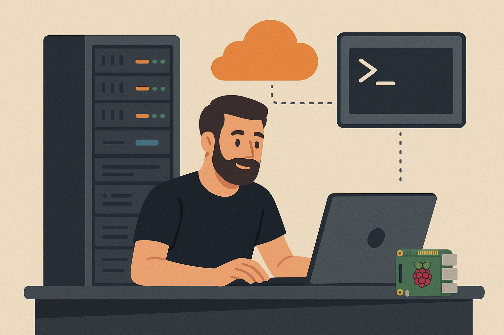

+++
author = 'Tim DevOps'
title = 'Por que todo dev deveria experimentar o self-hosting'
date = 2025-08-26T11:39:12-03:00
+++

---

Self-hosting ou “rodar suas próprias aplicações nos seus próprios servidores” parece coisa de nerd que gosta de sofrer. Mas a real é que esse hábito pode ensinar MUITA coisa que você não aprende só escrevendo código.

## O cenário

Quando a gente começa na área, normalmente foca em escrever features, rodar testes e dar deploy em alguma nuvem já pronta. Beleza, isso funciona.  
Mas quando você decide rodar um serviço **você mesmo** (seja num VPS baratinho, num Raspberry Pi, ou até numa VM em casa), a brincadeira muda de nível.

Você passa a ver o outro lado do software: **como ele vive, respira e quebra fora do “hello world”** e do localhost:3000

---

## O que você aprende sem querer

Self-hosting força a aprender um monte de coisa na marra:

- **Infra na prática**  
  Você descobre como instalar, configurar e manter apps de verdade.  
  Logs, updates, dependências… o pacote completo.

- **Networking de verdade**  
  DNS, SSL, portas, firewall, NAT… tudo aquilo que parecia teórico ganha contexto quando sua aplicação não abre no navegador.

- **Segurança mínima obrigatória**  
  Se você expõe algo na internet, precisa se preocupar com patches, backup, permissão de acesso… senão vai dormir e acordar minerando Bitcoin pra alguém 😅

- **DevOps sem badge**  
  Sem perceber, você tá aplicando práticas de DevOps: automatizando deploy, usando containers, monitorando uptime… tudo pra não ter que ficar debugando de madrugada.

- **Casca de produção**  
  Resolver erro bizarro no Nginx ou entender porque o banco não inicia no boot do servidor é experiência que tutorial nenhum te dá. Isso dá confiança quando o ambiente é realmente crítico.

---

## Minha experiência

Eu mesmo comecei assim: colocando no ar pequenos projetos pessoais, testando automações e hospedando coisinhas por conta própria.  
Esse “hobby” acabou virando experiência prática e abriu caminho pra trabalhar com **cloud e infraestrutura** depois.

---

## Como começar sem gastar muito

Você não precisa de servidor parrudo ou investimento pesado. Dá pra brincar com:

- Um **Raspberry Pi** em casa  
- Uma **VPS de $5**  
- Ou até rodar no próprio notebook, simulando o setup

Sugestões de projetos iniciais:

- Hospedar um **site monitor**  
- Rodar um **workflow automation tool** tipo n8n  
- Subir um **blog pessoal** sem depender de terceiros

O importante é começar simples e ir aprendendo com os perrengues.

---

## Conclusão

Self-hosting não é só “rodar coisas em casa”. É um atalho pra aprender infra, segurança, rede e DevOps de forma prática e divertida.  
E, quem sabe, pode até abrir novas portas na sua carreira.

No fim das contas, é aquilo: às vezes a melhor forma de aprender é justamente **meter a mão na massa e quebrar um pouco as coisas no caminho** 🚀
