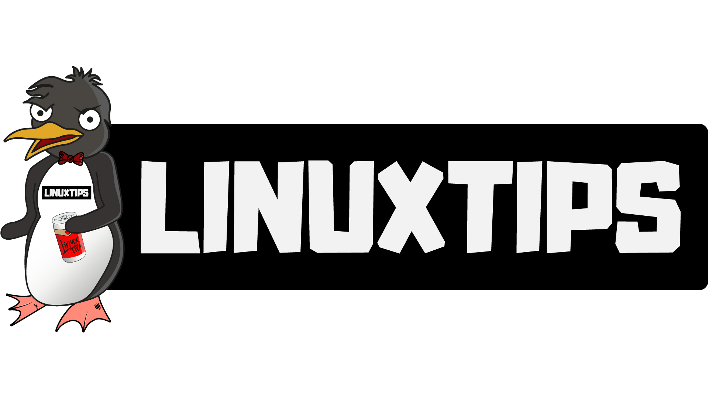

+++
author = "Renato Ruis (Tim)"
title = "Grátis! Treinamentos e materiais"
date = "2024-06-05"
description = "Treinamentos, cursos e materiais gratuitos testados e aprovados — Linux, cloud e mais."

+++

Minha jornada até aqui foi pavimentada pelo apoio da comunidade, e é hora de retribuir com #gratitude. <!--more--> Sou um grande fã e defensor das documentações oficiais — são os mapas do tesouro. Mas, às vezes, elas podem ser um pouco complexas, e um tanto chatas, não é?

Então, hoje trago para vocês sugestões especiais de treinamentos, cursos e materiais gratuitos (além das documentações oficiais) que são verdadeiras joias! Se tiverem feedback ou pedidos para mais dicas, é só deixar nos comentários ou me chamar aqui.

---

## 🐧 LinuxTips — Treinamentos 🐧

A LinuxTips hoje é uma central de treinamentos, A LinuxTips se tornou um hub de aprendizado! lembro de ter iniciado com um canal no Youtube do querido Jefferson Noronha, o cara é sensacional e tem uma forma peculiar de apresentar os treinamentos, Confiram os treinamentos gratuitos no site deles. São imperdíveis! #VAAAAII

---

## ❤️ Guia Foca — Material ❤️

Esse eu indico com muuuuito carinho, o Guia Foca pois foi minha porta de entrada para o Linux e hoje Linux é o mínimo necessário para qualquer pessoa técnica como DevOps, SRE e até Desenvolvedor.
Esse material foi criado pelo mestre Gleidson Mazioli lá em 1999 e até hoje pra mim é o melhor material sobre Linux em Português.

---

## 👨‍💻 Dicionário do Programador — Vídeos 👩‍💻

Esse canal é mais voltado para desenvolvedores, mas quem disse que o DevOps não precisa saber como funciona as linguagens, dependecias e etc, E o Gabriel e a Vanessa fazem isso com excelência no canal CodigoFonteTV mais expecíficamente nessa playlist aqui

---

## GCP — Treinamento & Material

O Google oferece muitos cursos e treinamentos gratuitos em várias áreas, mas esse aqui é mais voltado para Infra e Engenharia, tem alguns videos em ingles mas todos com legendas, o material é bem completo e cobre os principais conteúdos para certificações GCP o link é esse AQUI

---

## AWS Training and Certification — Treinamento & Material

O AWS Training and Certification é um canal oficial para preparações para certificações e tem bastante conteúdo em protugues e gratuito, portanto se procura conteúdo confiavel e oficial é AQUI

---

## KodeKloud — Treinamentos

Por último, mas não menos importante, KodeKloud. Mesmo em inglês, os recursos valem a pena. Comecem pelo programa Engineer KodeKloud gratuitamente para um overview fantástico. Eles também têm cursos acessíveis na Udemy. Confiram!

Espero que essas indicações possam te ajudar o tanto que me ajudou, compartilhe suas experiências também :)
